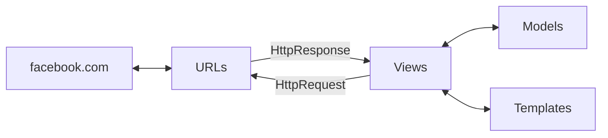

**MVT** stands for **Model View Template**
Model - Data Access Layer
Template - Presentation Layer
View -  Business Logic

```mermaid
graph LR
	A[facebook.com]
	B[URLs]
	C[Views]
	D[Models]
	E[Templates]
	A <--> B
	B --HttpResponse--> C
	C --HttpRequest--> B
	C <--> D
	C <--> E
```
