### NOTE
- Instead of `flowchart` one can also use `graph`.

#### A node (default)
```
---
title: Node
---
flowchart LR
	id
```
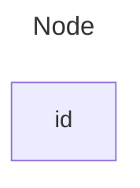
#### A node with text
```
---
title: Node with text
---
graph LR
	id1[This is the text in the box]
```
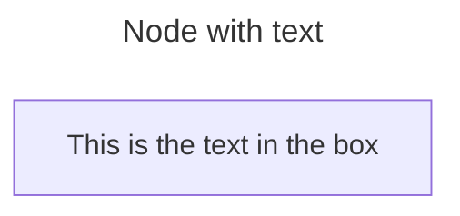
#### Unicode text
Use `"` to enclose the unicode text.
```
flowchart
	id["This ❤ Unicode"]
```
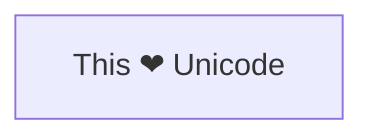
#### Markdown formatting
Use double quotes and backticks "` text `" to enclose the markdown text.
```
%%{init: {"flowchart": {"htmlLabels": false}} }%%
flowchart LR
	markdown["`This **is** _Markdown_`"]
	newLines["`Line 1
	Line 2
	Line 3`"]
	markdown --> newLines
```
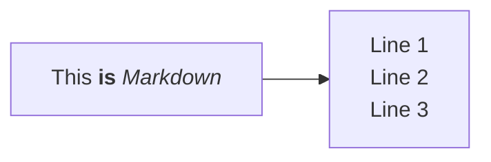
```
flowchart LR
	markdown["`This **is** _Markdown_`"]
	newLines["`Line 1
	Line 2
	Line 3`"]
	markdown --> newLines
```

#### Direction
This statement declares the direction of the Flowchart.
Possible FlowChart orientations are:
- TB - Top to bottom
- TD - Top-down/ same as top to bottom
- BT - Bottom to top
- RL - Right to left
- LR - Left to right
```
flowchart TB
	Start-->Stop
```
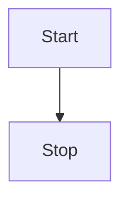
```
flowchart LR
	Start-->Stop
```
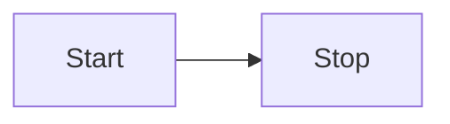
#### Node shapes
- **round edges:** `()`
- **stadium-shaped:** `([])`
- **subroutine shape:** `[[]]`
- **cylindrical-shape:** `[()]`
- **circle:** `(())`
- **asymmetric shape:** `>]`
- **rhombus:** `{}`
- **hexagon:** `{{}}`
- **parallelogram:** `[//]`
- **parallelogram alt:** `[\\]`
- **trapezoid:** `[/\]`
- **trapezoid alt:** `[\/]`
- **double circle:** `((()))`
1. A node with round edges
```
flowchart LR
	id1(This is the text in the box)
```
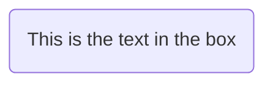
2. A stadium shaped node
```
flowchart LR
	id1([This is the text in the box])
```
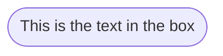
3. A node in a subroutine shape
```
flowchart LR
	id1[[This is the text in the box]]
```
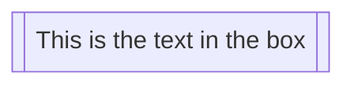
4. A node in a cylindrical shape
```
flowchart TB
	id1[(This is the text in the box)]
```
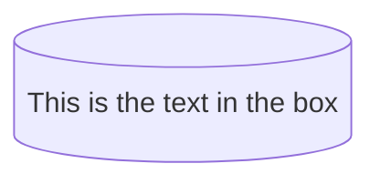
5. A node in the form of a circle
```
flowchart LR
	id((This is the text in the circle))
```
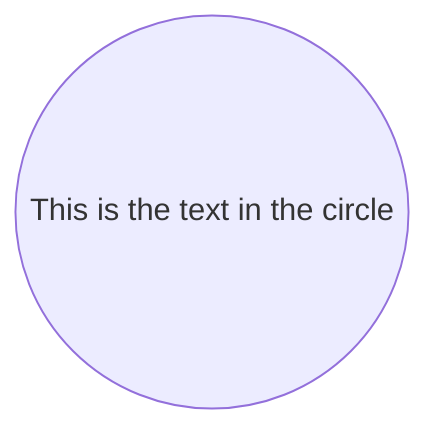
6. A node in an asymmetric shape
```
flowchart LR
	id1>This is the text in the box]
```
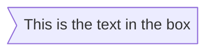
Currently only the shape above is possible and not its mirror. _This might change with future releases._
7. A node (rhombus)
```
flowchart LR
	id1{This is the text in the box}
```
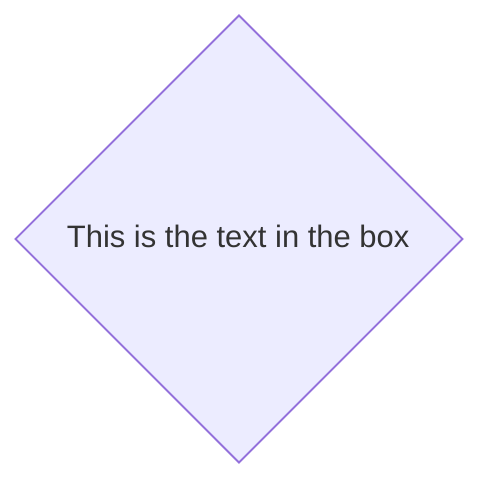
8. A hexagon node
```
flowchart LR
	id1{{This is the text in the box}}
```

9. Parallelogram
```
flowchart LR
	id1[/This is the text in the box/]
```
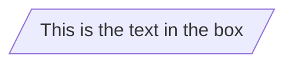
10. Parallelogram alt
```
flowchart LR
	id1[\This is the text in the box\]
```
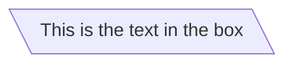
11. Trapezoid
```
flowchart LR
	id1[/This is the text in the box\]
```
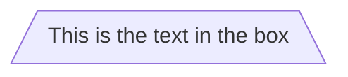
12. Trapezoid alt
```
flowchart LR
	id1[\This is the text in the box/]
```
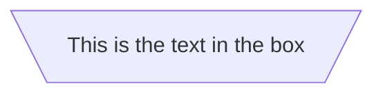
13. Double circle
```
flowchart LR
	id1(((This is the text in the box)))
```
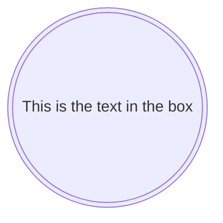
#### Links between nodes
1. A link with arrow head
```
flowchart LR
	A-->B
```
```mermaid
flowchart LR
	A-->B
```
2. An open link
```
flowchart LR
	A---B
```
```mermaid
flowchart LR
	A---B
```
3. Text on links
```
flowchart LR
	A-- This is the text! ---B
```
```mermaid
flowchart LR
	A-- This is the text! ---B
```
*OR*
```
flowchart LR
	A---|This is the text|B
```
```mermaid
flowchart LR
	A---|This is the text|B
```
4. A link with arrow head and text
```
flowchart LR
	A-->|text content here|B
```
```mermaid
flowchart LR
	A-->|text content here|B
```
*OR*
```
flowchart LR
	A-- text content here -->B
```
```mermaid
flowchart LR
	A-- text content here -->B
```
5. Dotted link
```
flowchart LR
	A-.->B
```
```mermaid
flowchart LR
	A-.->B
```
6. Dotted link with text
```
flowchart LR
	A-. text content here .->B
```
```mermaid
flowchart LR
	A-. text content here .->B
```
7. Thick line
```
flowchart LR
	A==>B
```
```mermaid
flowchart LR
	A==>B
```
8. Think line with text
```
flowchart LR
	A== text content here ==>B
```
```mermaid
flowchart LR
	A== text content here ==>B
```
9. An invisible link
This can be a useful tool in some instances where you want to alter the default positioning of a node.
```
flowchart LR
	A~~~B
```
```mermaid
flowchart LR
	A~~~B
```
10. Chaining of links
```
flowchart LR
A --text A to B--> B --text B to C--> C
```
```mermaid
flowchart LR
A --text A to B--> B --text B to C--> C
```
It is also possible to declare multiple nodes links in the same line as per below:
```
flowchart LR
	a --> b & c --> d
```
```mermaid
flowchart LR
	a --> b & c --> d
```
You can then describe dependencies in a very expressive way. Like the one-liner below:
```
flowchart TB
	a & b --> c & d
```
```mermaid
flowchart TB
	a & b --> c & d
```
In above can be done using 4 simple steps as well:
```
flowchart TB
	a --> c
	a --> d
	b --> c
	b --> d
```
```mermaid
flowchart TB
	a --> c
	a --> d
	b --> c
	b --> d
```
11. New arrow types
```
flowchart LR
	A --o B
	B --x C
```
```mermaid
flowchart LR
	A --o B
	B --x C
```
12. Multi directional arrows
```
flowchart LR
	A o--o B
	B x--x C
	C <--> D
```
```mermaid
flowchart LR
	A o--o B
	B x--x C
	C <--> D
```
13. Minimum length of a link
 By default, links can span any number of ranks, but you can ask for any link to be longer than the others by adding extra dashes in the link definition.
 ```
 flowchart TD
	 A[Start] --> B{Is it?}
	 B --> |Yes| C[OK]
	 C --> D[Rethink]
	 D --> B
	 B ---->|No| E[End]
```
 ```mermaid
 flowchart TD
	 A[Start] --> B{Is it?}
	 B --> |Yes| C[OK]
	 C --> D[Rethink]
	 D --> B
	 B ---->|No| E[End]
```
*OR*
```
flowchart TD
    A[Start] --> B{Is it?}
    B -- Yes --> C[OK]
    C --> D[Rethink]
    D --> B
    B -- No ----> E[End]
```
```mermaid
flowchart TD
    A[Start] --> B{Is it?}
    B -- Yes --> C[OK]
    C --> D[Rethink]
    D --> B
    B -- No ----> E[End]
```
For dotted or thick links, the characters to add are equals signs or dots, as summed up in the following table:

|Length|1|2|3|
|---|---|---|---|
|Normal|`---`|`----`|`-----`|
|Normal with arrow|`-->`|`--->`|`---->`|
|Thick|`===`|`====`|`=====`|
|Thick with arrow|`==>`|`===>`|`====>`|
|Dotted|`-.-`|`-..-`|`-...-`|
|Dotted with arrow|`-.->`|`-..->`|`-...->`|

#### Special characters that break syntax
It is possible to put text within quotes in order to render more troublesome characters. As in the example below:
```
flowchart LR
    id1["This is the (text) in the box"]
```
```mermaid
flowchart LR
    id1["This is the (text) in the box"]
```
**Entity codes to escape characters**
It is possible to escape characters using the syntax exemplified here.
```
flowchart LR
        A["A double quote:#quot;"] --> B["A dec char:#9829;"]
```
```mermaid
flowchart LR
        A["A double quote:#quot;"] --> B["A dec char:#9829;"]
```
### Subgraphs
```
flowchart TD
	c1 --> a2
	subgraph one
		a1 --> a2
	end
	subgraph two
		b1 --> b2
	end
	subgraph three
		c1 --> c2
	end
```
```mermaid
flowchart TD
	c1 --> a2
	subgraph one
		a1 --> a2
	end
	subgraph two
		b1 --> b2
	end
	subgraph three
		c1 --> c2
	end
```
You can also set an explicit id for the subgraph.
```
flowchart TB
	c1 --> a2
	subgraph ide1[one]
	a1 --> a2
	end
```
```mermaid
flowchart TB
	c1 --> a2
	subgraph ide1[one]
	a1 --> a2
	end
```
### flowcharts
With the graphtype flowchart it is also possible to set edges to and from subgraphs as in the flowchart below.
```
flowchart TD
	c1 --> a2
	subgraph one
	a1 --> a2
	end
	subgraph two
	b1 --> b2
	end
	subgraph three
	c1 --> c2
	end
	one --> two
	three --> two
	two --> c2
```
```mermaid
flowchart TD
	c1 --> a2
	subgraph one
	a1 --> a2
	end
	subgraph two
	b1 --> b2
	end
	subgraph three
	c1 --> c2
	end
	one --> two
	three --> two
	two --> c2
```

#### Direction of subgraphs
With the graph-type flowcharts you can use the direction statement to set the direction which the subgraph will render like in this example.
```
flowchart LR
	subgraph TOP
		direction TB
		subgraph B1
			direction RL
			i1 --> f1
		end
		subgraph B2
			direction BT
			i2 --> f2
		end
	end
	A --> TOP --> B
	B1 --> B2
```
```mermaid
flowchart LR
	subgraph TOP
		direction TB
		subgraph B1
			direction RL
			i1 --> f1
		end
		subgraph B2
			direction BT
			i2 --> f2
		end
	end
	A --> TOP --> B
	B1 --> B2
```
**Limitation**[​](https://mermaid.js.org/syntax/flowchart.html#limitation)
If any of a subgraph's nodes are linked to the outside, subgraph direction will be ignored. Instead the subgraph will inherit the direction of the parent graph:
```
flowchart LR
    subgraph subgraph1
        direction TB
        top1[top] --> bottom1[bottom]
    end
    subgraph subgraph2
        direction TB
        top2[top] --> bottom2[bottom]
    end
    %% ^ These subgraphs are identical, except for the links to them:

    %% Link *to* subgraph1: subgraph1 direction is mantained
    outside --> subgraph1
    %% Link *within* subgraph2:
    %% subgraph2 inherits the direction of the top-level graph (LR)
    outside ---> top2
```
```mermaid
flowchart LR
    subgraph subgraph1
        direction TB
        top1[top] --> bottom1[bottom]
    end
    subgraph subgraph2
        direction TB
        top2[top] --> bottom2[bottom]
    end
    %% ^ These subgraphs are identical, except for the links to them:

    %% Link *to* subgraph1: subgraph1 direction is mantained
    outside --> subgraph1
    %% Link *within* subgraph2:
    %% subgraph2 inherits the direction of the top-level graph (LR)
    outside ---> top2
```
